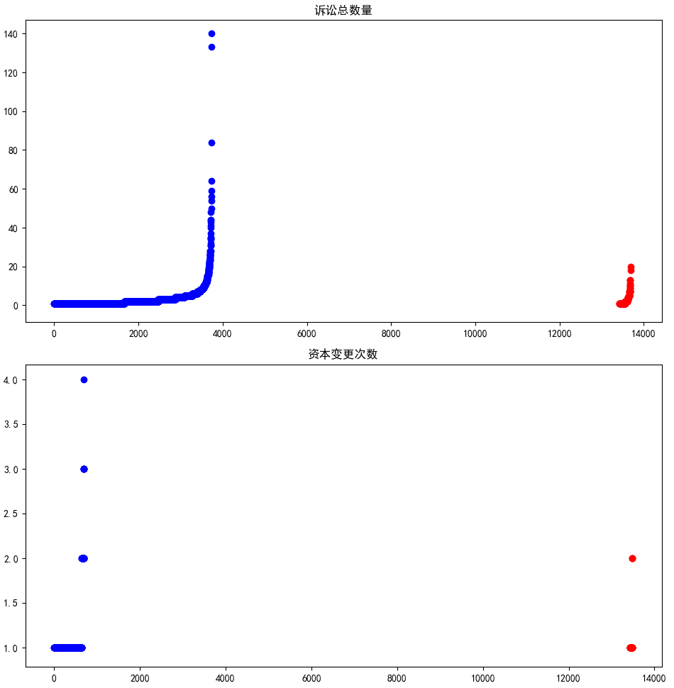

- Attention please: 

- **If you want to reprint my article, please mark the original address and author(刘书裴).**

- **If you are puzzled about a certain part or have some better suggestions, you can contact me: [3017218062@tju.edu.cn]()/[1005968086@qq.com]()**

- **If my blog has mistakes, I'm so sorry!**

- **I think and write everything. Please don't copy.**

- **Thanks for watching!**

| item | tool |
| :---: | :---: |
| image | mspaint |
| formula | Online LaTeX Equation Editor |
| language | python3.7 |
| date | 2020.4.17 |
| author | 刘书裴 |
| team | 辍学当主播 |

# Directory

1. [Contest analysis](#1)
2. [Data overview](#2)
3. [Data analysis](#3)
    1. [Data profile](#3.1)
    2. [Discrete features](#3.2)
    3. [Continuous features](#3.3)
    4. [Other features](#3.4)
4. [Feature engineering](#4)
    1. [Data clearing](#4.1)
    2. [Data encoding](#4.2)
    3. [Feature creating](#4.3)
    4. [Credit card rating](#4.4)
    5. [Feature selection](#4.5)
5. [Model selection](#5)
6. [Model fitting](#6)
7. [Model voting](#7)
8. [Rule building](#8)
9. [Contest score](#9)


# Structure


# Contest analysis
<a id="1"/>

- Background

建立健全社会信用体系，形成以道德为支撑、产权为基础、法律为保障的社会信用制度，是建设现代市场体系的必要条件，也是规范市场经济秩序的治本之策。山东省把建设健全的社会信用体系作为重要工作，打造信用中国（山东）品牌，青岛作为全国建立社会信用体系的先驱城市之一，积极贯彻实施信用中国（山东）指导思想，加强信用信息归集、推进公共信用建设，深度探索发挥信用在社会管理与服务中的基础作用。

- Task

根据企业的注册登记信息、缴税、资产负债表信息，判断企业是否为失信企业。

# Data overview
<a id="2"/>

| file | shape | nan/null |
| :---: | :---: | :---: |
| train.csv/train_stage2_update_20200320.csv | (14366, 664) | True |
| test.csv/test_stage2_update_20200320.csv | (9578, 664) | True |
| train_label.csv | (14366, 2) | False |

# Data analysis
<a id="3"/>

## Data profile
<a id="3.1"/>


<p>We can see that it contains a lot of sparse data and and missing values.</p>
<p>Let's look at the table introducing all features.(Without new features)


## Discrete features
<a id="3.2"/>

### 企业类型/登记机关/企业状态/行业代码/行业门类/企业类别/管辖机关/纳税人状态代码/登记注册类型代码


There are a few missing values and the most of them show partial distribution and unimodal distribution.

Obviously, it has no strong correlation with time features and label.

### 诉讼总数量/资本变更次数




They has many missing values, and after bi-sorted, they may has strong correlation with label(Uncertain thanks to too many missing values).

## Continuous features
<a id="3.3"/>

### 投资总额/注册资本/增值税/企业所得税/印花税/教育费/城建税/最新参保人数/年度参保总额


Every feature has a few outliers and is relatively centralized.

Then we can find they hava some special range for false label easily after bi-sorted.

### 递延收益_年初数~在建工程_年末数/资本变更


They are so bad features because too many missing values.

We can't find a few regularities. Thus leave them to the model.

### 案件数/诉讼数量/处罚程度/处罚类型/罚款金额


So sparsely features, they are as unobservable as above.

Leave them to the model.

## Other features
<a id="3.4"/>

### Time features


Because the dtype is object and the data is string, we need to convert time to seconds.

After bi-sorted, we can know that it has no strong correlation with time features and label.

### 邮政编码


this feature contains some invalid values like string and special values like Hong Kong, Taiwan.

After dropping invalid values and splitting the postal codes, there are many postal codes and a few other postal codes

For new features, It's possible that it has significant correlation with new features and label.

### 经营范围

It's a object feature, including many list. And the number of value is about 30000.

It's a vary interesting feature, and it's hard to deal with.

We will process it later.

# Feature engineering
<a id="4"/>

## Data clearing
<a id="4.1"/>

According data analysis, the outliers need to be drop for some features.

As following:
```
outlierThresholds = {
    "投资总额": 10000,
    "注册资本": 5000,
    "增值税": 1000,
    "企业所得税": 500,
    "教育费": 40,
    "城建税": 80,
    "诉讼总数量": 100,
    "最新参保人数": 500,
    "年度参保总额": 1500,
}
```

However, it doesn't work. So ignore "Data clearing".

## Data encoding
<a id="4.2"/>

For discrete(categorical) features, including 邮政编码, 经营范围 and time features, we use label encoding to transform them.

As following:
```
for i in catFeatures:
    data[i] = LabelEncoder().fit_transform(data[i])

for i in timeFeatures:
    data[i] = data[i].apply(lambda x: getTime(x))

data["邮政编码"] = data["邮政编码"].apply(
    lambda x: float(x) if str(x)[:6].isdigit() and float(x) >= 1e+5 else np.nan)
data["省"] = data["邮政编码"].apply(lambda x: x // 1e+4 if x else np.nan)
data["邮区"] = data["邮政编码"].apply(lambda x: x // 1e+3 if x else np.nan)
data["邮局"] = data["邮政编码"].apply(lambda x: x // 1e+2 if x else np.nan)
data["投递局"] = data["邮政编码"].apply(lambda x: x % 1e+2 if x else np.nan)
data["邮政编码"] = LabelEncoder().fit_transform(data["邮政编码"])
data["省"] = LabelEncoder().fit_transform(data["省"])
data["邮区"] = LabelEncoder().fit_transform(data["邮区"])
data["邮局"] = LabelEncoder().fit_transform(data["邮局"])
data["投递局"] = LabelEncoder().fit_transform(data["投递局"])
data["new经营范围"] = data["经营范围"].apply(lambda x: np.asarray([int(i) for i in str(x)[1:-1].split(", ")]))
data["经营范围"] = data["new经营范围"].apply(lambda x: len(x))
data["经营范围"] = LabelEncoder().fit_transform(data["经营范围"])
```

Luckily, it's useful.

## Feature creating
<a id="4.3"/>

This is the most important step. We will create lots of new features through addition, subtraction, multiplication and division.

But it should be noted that we need to delete some features whose missing proportion is greater than 90%.

As following:
```
tax = data[taxFeatures].fillna(0)
data["总税"] = tax[taxFeatures].sum(axis=1)
for i in range(len(taxFeatures)):
    f1 = taxFeatures[i]
    data[f1 + "exp"] = tax[f1].apply(lambda x: math.exp(x / 100))
    data[f1 + "ln"] = tax[f1].apply(lambda x: math.log(x) if x > 0 else 0)
    data[f1 + "/" + "总税"] = tax[f1] / (data["总税"] + 1e-7)
    data["总税" + "-" + f1] = data["总税"] - tax[f1]
    for j in range(i + 1, len(taxFeatures)):
        f2 = taxFeatures[j]
        data[f1 + "/" + f2] = tax[f1] / (tax[f2] + 1e-7)
        data[f2 + "/" + f1] = tax[f2] / (tax[f1] + 1e-7)
        data[f1 + "*" + f2] = tax[f1] * tax[f2]
        data[f1 + "-" + f2] = tax[f1] - tax[f2]
        data[f1 + "+" + f2] = tax[f1] + tax[f2]
        for k in range(j + 1, len(taxFeatures)):
            f3 = taxFeatures[k]
            data[f1 + "*" + f2 + "*" + f3] = tax[f1] * tax[f2] * tax[f3]
            data[f1 + "+" + f2 + "+" + f3] = tax[f1] + tax[f2] + tax[f3]

uselessFeatures = []
for i in otherFeatures:
    if (data[i].fillna(0).values == 0).sum() > data.shape[0] * 0.9:
        uselessFeatures.append(i)
otherFeatures = list(set(otherFeatures) - set(uselessFeatures))
otherFeatures.sort()
np.random.seed(2020)
np.random.shuffle(otherFeatures)
for i in range(len(otherFeatures)):
    f1 = otherFeatures[i]
    data[f1 + "exp"] = data[f1].apply(lambda x: math.exp(x / 10000) if x else np.nan)
    for j in range(i + 1, len(otherFeatures)):
        f2 = otherFeatures[j]
        data[f1 + "+" + f2] = data[f1] + data[f2]
        data[f1 + "-" + f2] = data[f1] - data[f2]
        data[f1 + "*" + f2] = data[f1] * data[f2]
        data[f1 + "/" + f2] = data[f1] / (data[f2] + 1e-7)
```

What's more, we need to process 经营范围.

We count all values, then calculate the number of values of every item and transform it to one-hot.

To reduce the numbers of new feature, we create one-hot in steps of 100.

As following:
```
scopeNum, mergeNum = 0, 100
businessScope = np.zeros((data.shape[0], 30000 // mergeNum), dtype=np.uint8)
for i, j in enumerate(data["new经营范围"].values):
    currentMax = j.max()
    scopeNum = currentMax if currentMax > scopeNum else scopeNum
    tmp = Counter(j // mergeNum)
    businessScope[i, list(tmp.keys())] = list(tmp.values())
scopeNum = (scopeNum + 1) // mergeNum + 1
businessScope = businessScope[:, :scopeNum]
data = pd.concat([data, pd.DataFrame(
    businessScope, columns=np.array(["经营范围_%d" % i for i in range(scopeNum)]), index=data.index
)], axis=1)
```

## Credit card rating
<a id="4.4"/>

The data is vary discrete, so we need to bucket the data.

The decision tree is a very ideal divider.

- Firstly Fit a classifier by training data.

- Then obtain the left and right children and threshold.

- Build the boundary.

- Use all data to calculate woe and iv.

- Merge the old features and new features.


As following:
```
def optimalBinningBoundary(x, y):
    clf = DecisionTreeClassifier(min_samples_leaf=0.001, max_leaf_nodes=32)
    clf.fit(x.reshape(-1, 1), y)

    nodeNum = clf.tree_.node_count
    childrenLeft, childrenRight = clf.tree_.children_left, clf.tree_.children_right
    threshold = clf.tree_.threshold

    boundary = []
    for i in range(nodeNum):
        if childrenLeft[i] != childrenRight[i]:
            boundary.append(threshold[i])

    boundary.sort()
    return [min(x)] + boundary + [max(x) + 0.1]

def caculateWoeIv(x, y, boundary):
    table = pd.concat([pd.Series(x), pd.Series(y)], axis=1)
    table.columns = ["x", "y"]
    table["bins"] = pd.cut(x=x, bins=boundary, right=False)
    grouped = table.groupby("bins")["y"]
    result = grouped.agg([
        ("good", lambda y: (y == 0).sum()),
        ("bad", lambda y: (y == 1).sum()),
        ("total", "count")
    ])

    result["good_prop"] = result["good"] / result["good"].sum()
    result["bad_prop"] = result["bad"] / result["bad"].sum()
    result["total_prop"] = result["total"] / result["total"].sum()
    result["bad_rate"] = result["bad"] / result["total"]

    result["woe"] = np.log(result["good_prop"] / result["bad_prop"] + 1e-7)
    result["iv"] = (result["good_prop"] - result["bad_prop"]) * result["woe"]
    result = result.reset_index()
    del result["bins"]
    return result

def mapWoeIv(x, f, boundary):
    x[x > boundary[-1]] = boundary[-1] - 1e-3
    x[x < boundary[0]] = boundary[0] + 1e-3

    table = pd.DataFrame({"x": x}, columns=["x"])
    table["bins"] = pd.cut(x=x, bins=boundary, right=False)
    group = table.groupby("bins")["x"]
    indexMap = []
    for j, k in enumerate(group):
        if k[-1].shape[0]:
            indexMap.append(pd.Series([j] * k[-1].shape[0], index=k[-1].index))
    indexMap = pd.concat(indexMap, axis=0).sort_index()
    woeIvs = []
    for name in woeIvTable.columns:
        woeIvs.append(indexMap.apply(lambda x: woeIvTable[name].iloc[x]))
    woeIvs = pd.concat(woeIvs, axis=1)
    woeIvs.columns = map(lambda x: f + "_" + x, list(woeIvTable.columns))
    return woeIvs
```

## Feature selection
<a id="4.5"/>

Use lgbm to get importances of all features, then select some features whose importance > 0.03.

10-fold validation(StratifiedKFold).

# Model selection
<a id="5"/>

Tree model: xgboost, lgbm, catboost

Network model: fc, 1d-cnn, lstm

Finally, we choose lgbm.

Params:
```
n_estimators=1000,
learning_rate=0.1,
objective="binary",
metric="auc",
num_leaves=2 ** 5 - 1,
max_depth=-1,
min_child_weight=2,
subsample=0.8,
colsample_bytree=0.8,
reg_alpha=0.3,
reg_lambda=0.7,
n_jobs=-1,
random_state=2020,
is_unbalance=True,
```

# Model fitting
<a id="6"/>

10-fold validation and early stopping(50).

# Model voting
<a id="7"/>

We set 10 epochs with different seeds, then for every epoch, we use 10-fold validation to predict results.

For every result, we multiply it by score of its epoch.

There are 100 set of results, we calculate mean values of them.

# Rule building
<a id="8"/>

Like data clearing, for certain item including special values, we change it to the corresponding label.

# Contest score
<a id="9"/>

| A | B |
| :---: | :---: |
| 0.936280 | 0.92152 |
